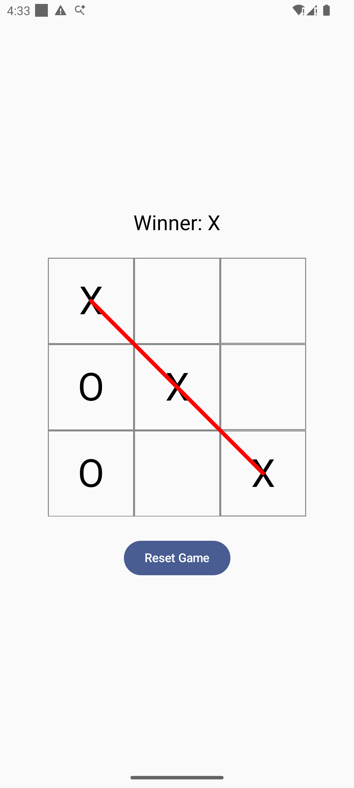
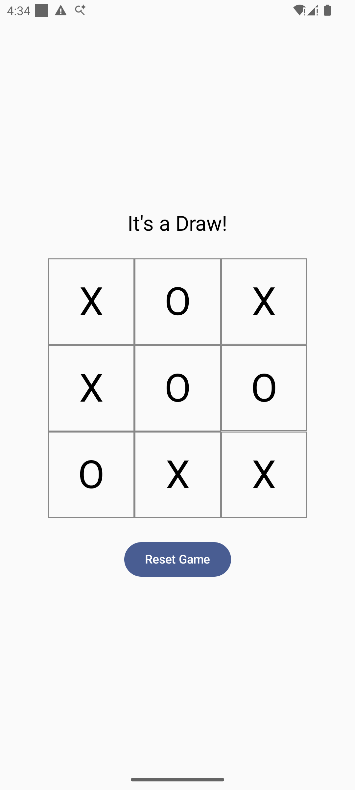

# Tic-Tac-Toe

A classic Tic-Tac-Toe game implementation. This project is a simple, interactive game where two players can compete against each other.

## How to Play

1.  The game is played on a grid that's 3 squares by 3 squares.
2.  One player is X, and the other is O. Players take turns putting their marks in empty squares.
3.  The first player to get 3 of their marks in a row (up, down, across, or diagonally) is the winner.
4.  When all 9 squares are full, the game is over. If no player has 3 marks in a row, the game ends in a tie.

## Features

*   A 3x3 game board.
*   Two-player gameplay (Player X and Player O).
*   Win detection for rows, columns, and diagonals.
*   Detection of a draw game.
*   A reset button to start a new game.

## Project Structure

The project follows the recommended Android app architecture, separating concerns into different layers:

*   `app/src/main/java/com/bnp/tictactoe/data`: The data layer, responsible for providing data to the application. It contains the implementation of the game repository.
*   `app/src/main/java/com/bnp/tictactoe/domain`: The domain layer, which contains the business logic of the application. This includes models, use cases, and the repository interface.
*   `app/src/main/java/com/bnp/tictactoe/ui`: The UI layer, which displays the application's data on the screen. This layer includes composable functions for the game screen and its components.
*   `app/src/main/java/com/bnp/tictactoe/viewmodel`: The ViewModel, which acts as a bridge between the domain and UI layers.

## Technologies Used

*   **Kotlin**: The primary programming language for the application.
*   **Jetpack Compose**: For building the user interface.
*   **Hilt**: For dependency injection.
*   **StateFlow**: For managing state in a reactive way.
*   **JUnit & Mockito**: For unit and instrumentation testing.

## Architectural and Design Decisions

This project is built upon the principles of **Clean Architecture** to create a modular, scalable, and testable codebase.

*   **Layered Architecture**: The app is divided into three distinct layers:
    *   **UI Layer**: Handles all UI-related logic and user interactions using Jetpack Compose.
    *   **Domain Layer**: Contains the core business logic and use cases of the game.
    *   **Data Layer**: Manages data operations and provides a clean API for the domain layer.
*   **Model-View-ViewModel (MVVM)**: The MVVM pattern is used to separate the UI from the business logic. The `ViewModel` exposes the state to the UI and handles user interactions.
*   **Unidirectional Data Flow (UDF)**: State flows down from the `ViewModel` to the UI, and events flow up, ensuring predictable state management.
*   **Dependency Injection (DI)**: Hilt is used for managing dependencies, which enhances modularity and testability.
*   **Reactive Programming**: `StateFlow` is used to expose the game state, allowing the UI to react to changes automatically.
*   **Test-Driven Development (TDD)**: Features are developed by writing failing tests first, ensuring robust and well-tested code.
*   **State Hoisting**: UI components are kept stateless by lifting the state up to a common ancestor, making them more reusable and testable.

## Screenshots

| Game in Progress |                              Player X Wins                               |                              Draw Game                               |
|:--------------:|:------------------------------------------------------------------------:|:--------------------------------------------------------------------:|
|          |  |  |

## Getting Started

To get a local copy up and running, follow these simple steps:

1.  **Clone the repository:**
    ```sh
    https://github.com/2026-DEV2-029/Tictactoe.git
    ```
2.  **Open in Android Studio:**
    Open the project in Android Studio and wait for Gradle to sync.
3.  **Run the app:**
    Select the `app` configuration and run it on an emulator or a physical device.

## Testing

To run the tests, you can either use the command line or Android Studio.

*   **To run all unit tests from the command line:**
    ```sh
    ./gradlew test
    ```
*   **To run all instrumentation tests from the command line:**
    ```sh
    ./gradlew connectedAndroidTest
    ```

